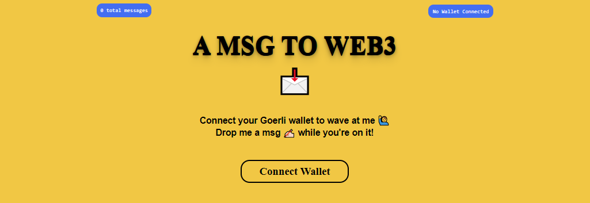
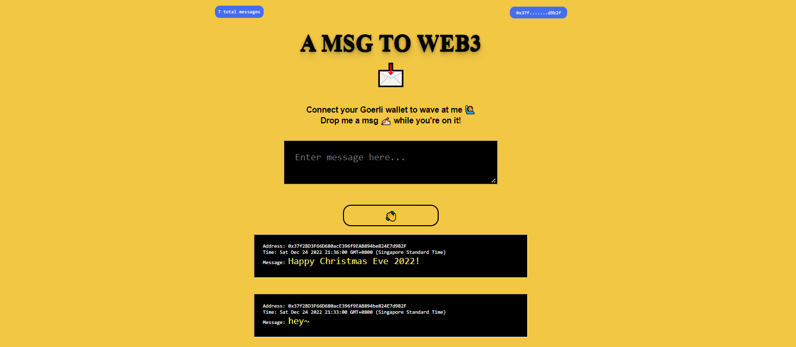

# Wave Portal Dapp

This repo contains coursework project from [buildspace](https://buildspace.so/) completed by [0xsenzel](https://github.com/0xSenzel/) for [Build an Ethereum Dapp](https://buildspace.so/builds) lesson.

## Project Info

Website where anyone with Ethereum wallet on Goerli Testnet able to send me a 👋 + a message and have that data saved on the blockchain through an Ethereum smart contract.

## Project Demo

<figure>

<p align="center">Fig.1 - Home Page</p>
</figure>

<br/>

<figure>

<p align="center">Fig.2 - Connected with wallet</p>
</figure>

<br/>

<figure>

<p align="center">Fig.3 - When send us a "wave"</p>
</figure>

<br/>

## Project Setup

### Hardhat

Head to [smart-contracts](./smart-contracts/) folder:

Install dependencies

```
npm install
```

Compile smart contract

```
npx hardhat compile
```

To deploy smart contracts: <br/>
Head to [hardhat.config.js](./smart-contracts/hardhat.config.js) file, change the value of:

- `ALCHEMY_HTTP_URL` with your own Ethereum Network API
- `PRIVATE_KEY` with your Ethereum wallet's private key
- `API_KEY` with your Etherscan's API Key

Then run the following command.

```
npx hardhat run scripts/deploy.js --network goerli
npx hardhat verify --network goerli YOUR_SMARTCONTRACT_ADDRESS "CONSTRUCTOR ARG1" "CONSTRUCTOR ARG2"
```

<br/>

### React Js

Head to [my-app](./my-app/) folder:

```
npm install
```

Replace the variable inside [this file](./my-app/src/App.js):

- Line24 `contractAddress` variable with your own deployed contract address.

To run the app locally:

```
npm run start
```
